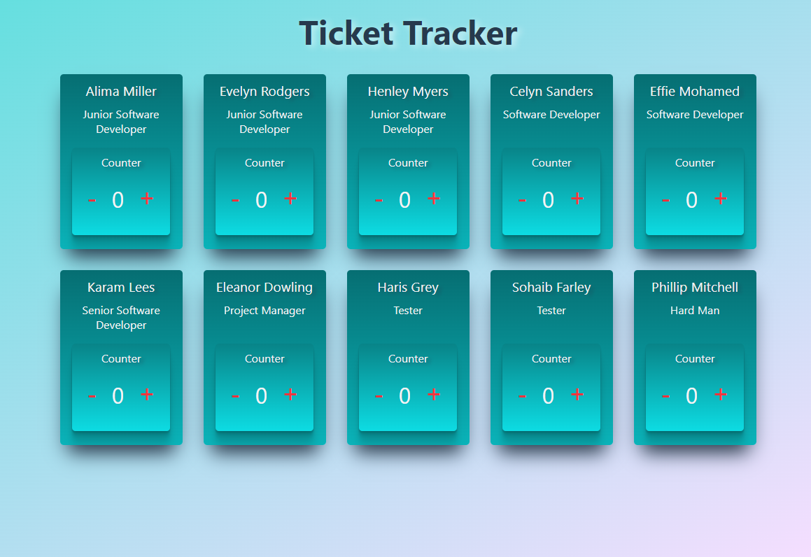

# Task

To build the project in React.

Create a ticket tracking system.

Each employee on the data file should be able to increment/decrement their ticket count.

As an employee, to keep count of all the tickets I have completed, so that I can manage my workflow.

As an employee, to keep track of the number of tickets my coworkers have completed, so that I can compare the number of tickets we complete.

